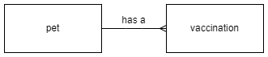

# Database Design and Development

## Notes

All the code examples use SQLite.  They will work with [DB Browser for SQLite](https://sqlitebrowser.org/).

These notes are focused on N5 Computing Science so some terms might be used differently.

SQLite, and SQL, keywords are not case sensitive.  The following are all equally valid:

``` sql
SELECT / SeLeCt / select
```

In the examples, the keywords will be in uppercase.

SQLite, and SQL, is not whitespace sensitive.  This means a statement can be all on a single line or split over multiple lines.  In general, the examples have one keyword per line.

The statements are terminated with a semicolon, __`;`__.  An individual statement will run without a semicolon but multiple statements will not.


## Attribute types (Data types)

SQLite has fewer data types than SQL.  However, SQL datatypes can be used and SQLite will match these to it's own datatypes.

| Data type     | Example data |
| ---------     | ------------ |
| Text          | "Cat", "01871 810100" |
| Number (INT)  | -99, 0, 99 |
| Number (REAL) | -99.0, 0.0, 99.0 |
| Date          | "2024-02-29" |
| Time          | "13:15:00" |
| Boolean       | TRUE, FALSE |


## Example Data

The example [database](N5-CS-Database.db) contains the tables and records that the SQL examples will work with. The file can be opened with [DB Browser for SQLite](https://sqlitebrowser.org/).

The first 4 records of the data used in the examples are shown in the following tables:

### Table: Pet

| petID | name     | species | dob |
| :---: | ----     | ------- | --- |
| 1     | Hans     | Cat     | 2015-09-22 |
| 2     | Minnnie  | Gerbil  | 2021-05-24 |
| 3	    | Bo       | Rabbit  | 2011-10-13 |
| 4     | Joscelin | Gerbil  | 2022-02-19 |

### Table: Vaccination

| vaxID | petID | vaxDate    | name             | reaction | price |
| :---: | :---: | -------    | ----             | :------: | ----- |
| 1     | 13    | 2019-09-03 | Distemper        | TRUE     | 45.00 |
| 2     | 5     | 2020-06-23 | Canine hepatitis | FALSE    | 35.50 |
| 3     | 1     | 2015-12-17 | Cat Flu          | FALSE    | 12.99 |
| 4     | 17    | 2015-10-05 | Cat Flu          | FALSE    | 12.99 |


## ER Diagram




### Views tables

To view all the tables in the database the `name` field of the `sqlite_schema` table is displayed.

``` sql
SELECT name
    FROM sqlite_schema
    WHERE type = "table";
```


## Information

### Comments

Single line comment.

``` sql
-- This comment is not displayed
```

Multiline comment.

``` sql
/*
This comment is not displayed
This comment is not displayed
*/
```

### Display information
It is possible to display simple messages (DB Browser for SQLite).

``` sql
SELECT "Hello World!";
```

## Display Data

To search a database, a basic statement with two keywords `SELECT` and `FROM` is used.

The `SELECT` keyword lists the required field(s).  The `FROM` keyword states the table(s) that the fields are in.

To display all the fields the __`*`__ symbol is used.

``` sql
SELECT *
    FROM Pet;
```

To select one, or more fields, their names are used.

``` sql
SELECT name, species
    FROM Pet;
```


## Filter results

To limit the number of records returned, the `WHERE` keyword is used with a comparison operator.

**Note:** Whilst SQL keywords are not case sensitive, search terms are.  Searching for `Hello` will not find `hello`, `HELLO`, or any other variation.

### Comparison operators

Comparison operators are used to compare one value with another.

| Symbol | Meaning |
| :----: | :------ |
| =      | Equality (the same as) |
| <>     | Inequality (not the same as) |
| >      | Greater than |
| >=     | Greater than or equal to |
| <      | Less than |
| <=     | Less than or equal to |

### Simple search

A simple search compares a field in a record with a value.  If the comparison is `True` then the required fields of that record are displayed.

``` sql
SELECT *
    FROM Vaccination
    WHERE species = "Cat";
```

### Complex search

A complex search compares two fields.

#### AND

If both comparisons are `True` then the required fields of that record are displayed.

``` sql
SELECT *
    FROM Vaccination
    WHERE name = "Distemper"
      AND reaction = TRUE;
```

#### OR

If either comparison is `True` then the required fields of that record are displayed.

``` sql
SELECT *
    FROM Vaccination
    WHERE name = "Distemper"
       OR reaction = TRUE;
```


## Sort results

It is possible to sort the output of a search using `ORDER BY` and stating the field, or fields.  Fields are sorted ascending, smallest to largest, by default.

``` sql
SELECT *
    FROM Pet
    ORDER BY species ASC;
```

To change the sort order of a field to descending the keyword `DESC` used.  The keyword `ASC` is not needed but can be used to explicitly sort ascending.  More than one field can be sorted.

``` sql
SELECT *
    FROM Pet
    ORDER BY species DESC, 
             name ASC;
```


## Equi-join between tables

Tables are joined using the primary key of one table and the foreign key of the other table.

### Generic

``` sql
SELECT *
    FROM table1, table2
    WHERE table1.primaryKey = table2.foreignKey;
```

### Example

**Note:** In this example both tables have a field with the same name.  So that the database can distinguish between the fields they must be qualified with the table name.  Just using the field name would be _ambiguous_.

``` sql
SELECT *
    FROM Pet, Vaccination
    WHERE pet.petID = vaccination.petID;
```


## Add New Data

It is possible to insert a record, multiple records, or partial records into a table using `INSERT INTO` and `VALUES`.  All validation rules must be met for the new data to be added.

### Single record

``` sql
INSERT INTO Pet
    VALUES (26, "Tiger", "Cat", "2022-04-17");
```

### Multiple records

``` sql
INSERT INTO Pet
    VALUES (27, "Bill", "Ferret", "2022-05-01"),
           (28, "Ben", "Ferret", "2022-05-01");
```

### Partial record(s)

If a partial record is added then the field names must be stated.  The values must be in the same order as the fields.

``` sql
INSERT INTO Pet (species, name, petID)
    VALUES ("Dog", "Winston", 29);
```


## Modify Data

**Note:** It is possible to damage the data with an `UPDATE` statement.  It is advisable to practise with a `SELECT` statement first to see if the correct record, or records, will be changed.

### Single value changed

``` sql
UPDATE Pet
    SET dob = "2022-04-01"
    WHERE petID = 29;
```

### Multiple  values changed

``` sql
UPDATE Pet
    SET name = "Churchill", 
        species = "Cat"
    WHERE petID = 29;
```

__Caution__: without the `WHERE` clause all records would be updated!


## Remove Data

**Note:** It is possible to damage the data with a `DELETE FROM` statement.  It is advisable to practise with a `SELECT` statement first to see if the correct record, or records, will be deleted.

``` sql
DELETE FROM Pet
    WHERE petID = 29;
```

__Caution__: without the `WHERE` clause all records would be deleted!


## Create a table

### Data types

| Type    | SQL             | Comment |
| ----    | ---             | ------- |
| Text    | VARCHAR(`size`) | Size = number of characters |
| Number  | INT or REAL     | |
| Date    | DATE            | YYYY-MM-DD |
| Time    | TIME            | HH:MM:SS |
| Boolean | BOOL            | |

### Validation

| Type              | SQL |
| ----              | --- |
| Presence check    | NOT NULL |
| Restricted choice | CHECK (`field` IN (`list of values`)) |
| Field length      | CHECK (LENGTH(`field`) = `value`) |
| Range             | CHECK (`field` >= `lower value` AND `field` <= `upper value`) |

### Example

### Data dictionaries

### Entity: Vehicle

| Attribute | Key   | Type    | Size  | Req'd | Validation |
| --------- | :---: | ----    | :---: | :---: | ---------- |
| vehReg    | PK    | text    | 8     | Y     | length: >=4 |
| make      |       | text    | 20    | N     | |
| model     |       | text    | 20    | N     | |
| colour    |       | text    | 15    | Y     | |

### Entity: repair

| Attribute    | Key   | Type    | Size  | Req'd | Validation |
| ---------    | :---: | ----    | :---: | :---: | ---------- |
| repairNo     | PK    | number  |       | Y     | |
| vehReg       | FK    | text    | 8     | Y     | Exists in vehicle table |
| repairDate   |       | date    |       | N     | |
| costEstimate |       | number  |       | N     | range: >= 0.00 |
| costActual   |       | number  |       | N     | range: >= 0.00 |
| completed    |       | boolean |       | Y     | |
| paid         |       | text    | 7     | Y     | Restricted choice: Nothing, Part, All |

### SQL

``` sql
CREATE TABLE Vehicle (
    vehReg VARCHAR(8) NOT NULL 
        CHECK (LENGTH (vehReg >= 4)),
    make VARCHAR(20),
    model VARCHAR(20),
    colour VARCHAR(15) NOT NULL,
    PRIMARY KEY (vehReg)
);
```

``` sql
CREATE TABLE Repair (
    repairNo INT NOT NULL,
    vehReg VARCHAR(8) NOT NULL,
    repairDate DATE,
    costEstimate REAL 
        CHECK (costEstimate >= 0),
    costActual REAL 
        CHECK (costActual >= 0),
    completed BOOL NOT NULL,
    paid VARCHAR(7) NOT NULL
        CHECK (paid IN ("Nothing", "Part", "All")),
    PRIMARY KEY (repairNo),
    FOREIGN KEY (vehReg)
        REFERENCES Vehicle (vehReg)
);
```


## Modify a table

Modifying a table involves a number of steps:

 1. Get the details of the table
 2. Create a new table using the modified details of the old table
 3. Copy the data from the old table to the new table
 4. Check the data has been copied
 5. Turn off referential integrity - _if needed_
 6. Delete the old table
 7. Rename the new table as the old table
 8. Turn on referential integrity - _if needed_

### 1. Get details

To view the field names, keys, data types, and validation of a table the `sqlite_schema.sql` field for the required table is displayed:

``` sql
SELECT sql
    FROM sqlite_schema
    WHERE tbl_name = "vaccination";
```

The output will look similar to:

``` sql
CREATE TABLE Vaccination (
    vaxID INT NOT NULL,
    petID INT NOT NULL,
    vaxDate DATE NOT NULL,
    name VARCHAR(30) NOT NULL,
    reaction BOOL NOT NULL,
    price REAL NOT NULL,
    PRIMARY KEY (vaxID),
    FOREIGN KEY (petID) 
        REFERENCES pet (petID)
)
```

### 2. Create new table

Create a new table by copying and pasting the output of Step 1, with the required changes made.

``` sql
CREATE TABLE NewVaccination (
    vaxID INT NOT NULL,
    petID INT NOT NULL,
    vaxDate DATE NOT NULL,
    name VARCHAR(30) NOT NULL 
        CHECK (LENGTH (name) >= 2),
    reaction BOOL NOT NULL,
    price REAL NOT NULL 
        CHECK (price >= 10 
           AND price <= 100),
    PRIMARY KEY (vaxID),
    FOREIGN KEY (petID) 
        REFERENCES Pet (petID)
);
```

### 3. Copy data

Copy the data from the old table into the new table.

``` sql
INSERT INTO NewVaccianation
    SELECT *
    FROM Vaccination;
```

### 4. Check data

Check that the data has been copied into the new table.

``` sql
SELECT *
    FROM NewVaccianation;
```

### 5. Turn off referential integrity

If the primary key of the old table is used as a foreign key  in another table then referential integrity will need to be turned off.

``` sql
PRAGMA foreign_keys = off;
```

### 6. Delete old table

Delete the old table.

``` sql
DROP TABLE Vaccination;
```

### 7. Rename new table

Rename the new table.

``` sql
ALTER TABLE NewVaccination
    RENAME TO Vaccination;
```

### 8. Turn on referential integrity

If referential integrity was turned off, it will needed to be turned on.

``` sql
PRAGMA foreign_keys = on;
```

## Examples

### Display data

Select various fields from two tables, with two search conditions and ordered on two fields.

``` sql
SELECT Pet.name, species, Vaccination.name, vaxDate
    FROM Pet, Vaccination
    WHERE Pet.petID = Vaccination.petID
      AND species = "Rabbit"
    ORDER BY Pet.name ASC,
             vaxDate DESC;
```

### Change data

Update vaccination records so that **Feline Leukaemia Virus** is replaced with **FLV**.

* Create a `SELECT` statement to test that the `WHERE` clause selects the correct records.

``` sql
SELECT *
    FROM Vaccination
    WHERE name = "Feline Leukaemia Virus";
```

* Create an `UPDATE` statement to update the correct records.

``` sql
UPDATE Vaccination
    SET name = "FLV"
    WHERE name = "Feline Leukaemia Virus";
```

* Check that the changes have been made.

``` sql
SELECT *
    FROM Vaccination
    WHERE name = "FLV"
       OR name = "Feline Leukaemia Virus";
```
<!--stackedit_data:
eyJoaXN0b3J5IjpbMTAzNDQ1ODQxMCwtMTEyOTMwMjAxNCwxMj
M5NDg3NDUyLC04MTY2OTQ0ODMsMTk0MTE0MTI5MywxMDM4ODQ3
MywtMTI0NTAzNzkwOSwxNTk5MTAzOTIzLDg3MzA2NDExMCwxOT
U0NzkyNTM5LC05NTg1OTg0MzEsLTEyMzM5ODQ3MzZdfQ==
-->