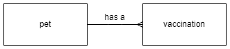

# Database Design and Development

## Notes

All the code examples use SQLite.  They will work with [DB Browser for SQLite](https://sqlitebrowser.org/).

These notes are focused on N5 Computing Science so some terms might be used differently.

SQLite, and SQL, keywords are not case sensitive.  The following are all equally valid:

``` sql
SELECT / SeLeCt / select
```

In the examples, the keywords will be in uppercase.

SQLite, and SQL, is not whitespace sensitive.  This means a statement can be all on a single line or split over multiple lines.  In general, the examples have one keyword per line.

The statements are terminated with a semicolon, __`;`__.  An individual statement will run without a semicolon but multiple statements will not.


## Attribute types (Data types)

SQLite has fewer data types than SQL.  However, SQL datatypes can be used and SQLite will match these to it's own datatypes.

| Data type     | Example data |
| ---------     | ------------ |
| Text          | "Cat", "01871 810100" |
| Number (INT)  | -99, 0, 99 |
| Number (REAL) | -99.0, 0.0, 99.0 |
| Date          | "2024-02-29" |
| Time          | "13:15:00" |
| Boolean       | TRUE, FALSE |


## Example Data

The example [database](N5-CS-Database.db) contains the tables and records that the SQL examples will work with. The file can be opened with [DB Browser for SQLite](https://sqlitebrowser.org/).

The first 4 records of the data used in the examples are shown in the following tables:

### Table: Pet

| petID | name     | species | dob |
| :---: | ----     | ------- | --- |
| 1     | Hans     | Cat     | 2015-09-22 |
| 2     | Minnnie  | Gerbil  | 2021-05-24 |
| 3     | Bo       | Rabbit  | 2011-10-13 |
| 4     | Joscelin | Gerbil  | 2022-02-19 |

### Table: Vaccination

| vaxID | petID | vaxDate    | name             | reaction | price |
| :---: | :---: | -------    | ----             | :------: | ----- |
| 1     | 13    | 2019-09-03 | Distemper        | TRUE     | 45.00 |
| 2     | 5     | 2020-06-23 | Canine hepatitis | FALSE    | 35.50 |
| 3     | 1     | 2015-12-17 | Cat Flu          | FALSE    | 12.99 |
| 4     | 17    | 2015-10-05 | Cat Flu          | FALSE    | 12.99 |


## ER Diagram




### Views tables

To view all the tables in the database the `name` field of the `sqlite_schema` table is displayed.

``` sql
SELECT name
    FROM sqlite_schema
    WHERE type = "table";
```


## Information

### Comments

Single line comment.

``` sql
-- This comment is not displayed
```

Multiline comment.

``` sql
/*
This comment is not displayed
This comment is not displayed
*/
```

### Display information
It is possible to display simple messages (DB Browser for SQLite).

``` sql
SELECT "Hello World!";
```
